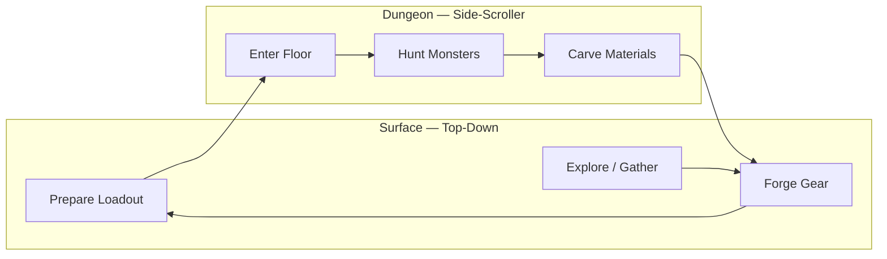

# Destiny Forge — Game Design Document

A pixelated Rust game that blends **Stardew Valley**-style farming and mining with **Monster Hunter**-style weapon and armor progression.

---

## Vision

**Destiny Forge** is a cozy-yet-challenging loop: tend your homestead above ground, then descend into dungeons to hunt monsters, carve materials, and forge gear that changes how you fight and farm.

| Inspiration | What we borrow |
|-------------|----------------|
| Stardew Valley | Day cycles, tile-based farming, mining, inventory, satisfying resource loops |
| Monster Hunter | Craft gear from monster parts, weapon upgrade trees, armor set bonuses, prep-before-hunt |

### Long-term pillars (post-MVP)

- **Fish farming** — ponds, species, feed, harvest yields
- **Surface mining** — ore nodes, pickaxe tiers, stamina
- **Homestead** — top-down farm, mine entrance, forge, town
- **Dungeons** — side-scrolling floors, monsters, loot
- **Forging** — weapons and armor crafted from carved materials

---

## Perspective & World Structure

| Zone | Camera | Notes |
|------|--------|-------|
| Overworld (farm, mine, town) | **Top-down** | Tilemap-based, Stardew-like movement and interaction |
| Dungeons | **Side-scroller** | Platformer combat, room/floor transitions, distinct feel from surface life |

The shift in perspective reinforces the fantasy: calm preparation above, intense hunts below.

---

## Core Game Loop



**MVP loop (Phase 1):** enter dungeon → fight monsters → carve parts → return to forge → craft basic weapons and armor → re-enter with better gear.

Farming and surface mining plug into this loop later as additional material sources and downtime activities.

---

## Tech Stack

| Layer | Choice | Rationale |
|-------|--------|-----------|
| Language | **Rust** | Performance, safety, good fit for game logic |
| Engine | **Bevy** | ECS architecture scales for farming sim + combat + inventory |
| Overworld rendering | **bevy_ecs_tilemap** | Pixel tilemaps, 16×16 or similar |
| Dungeon rendering | **Bevy 2D** (sprites, cameras) | Side-scroller layers, parallax optional later |
| Game data | **RON / TOML** | Fish species, ores, weapons, armor, recipes as data files |
| Saves | **serde + bincode** (or RON) | World state, inventory, gear, dungeon progress |

---

## Architecture (Fresh Start)

Starting **completely over** on the `revamp` branch. No carry-over from the old monolithic `main.rs`; reuse ideas only where they still fit.

```
src/
├── core/           # App states, time, save/load, scene transitions
├── dungeon/        # Side-scroller: floors, rooms, platforming, spawns
├── combat/         # Hitboxes, damage, weapons, armor skills
├── forging/        # Recipes, forge UI, craft validation
├── items/          # Materials, weapons, armor, stacks
├── progression/    # Weapon trees, armor sets, unlock rules
├── player/         # Movement (mode-specific), stats, loadout
├── ui/             # Inventory, forge, HUD, menus
├── overworld/      # Top-down zones (stub until post-MVP)
└── main.rs         # Plugin registration only
```

Organize by **game mode** and **domain**, not by a single giant update loop.

---

## Coding Standards — Clean Code (Robert C. Martin)

All Rust code in this project follows the principles from *Clean Code*. The ECS architecture already encourages separation of concerns; these rules keep that discipline explicit.

### Meaningful names

- Types, functions, and variables reveal intent without comments: `CarveLootTable`, `try_craft_recipe`, `equipped_armor_pieces`
- Avoid abbreviations and noise words (`data`, `info`, `manager`, `handle_thing`)
- Names are pronounceable and searchable; one word per concept (`craft` not `make`/`build`/`create` interchangeably)

### Small functions

- Functions do **one thing**, do it well, and do it only
- Prefer ~5–15 lines per function; extract when a function mixes concerns (e.g. input + validation + mutation)
- One level of abstraction per function — a system orchestrates, helpers perform single steps

### SOLID (adapted for Rust + Bevy)

| Principle | How we apply it |
|-----------|-----------------|
| **S**ingle Responsibility | One plugin/module per domain (`dungeon`, `forging`, `combat`); one system per behavior |
| **O**pen/Closed | New weapons, armor sets, and recipes extend via data/types — not by editing core loops |
| **L**iskov Substitution | Shared traits (`Item`, `Recipe`) behave consistently across all implementors |
| **I**nterface Segregation | Small traits and marker components instead of fat “god” components |
| **D**ependency Inversion | Systems depend on resources/traits; content is injected via plugins and data |

### Comments

- Code explains **what**; comments explain **why** (non-obvious rules, balance notes, deferred work)
- No commented-out code in commits; no journal-style change logs in source files
- TODOs include context: `// TODO(phase-2): persist inventory when save system lands`

### Formatting & structure

- Consistent module layout: `plugin.rs` registers systems; behavior lives in focused files
- `main.rs` only wires plugins — no game logic
- Related code stays vertically close; variables declared near first use
- Boy Scout Rule: leave every file slightly cleaner than you found it

### Error handling

- Recoverable game logic returns `Option` or `Result` — not panics
- `expect`/`unwrap` only for programmer invariants (e.g. “player exists in dungeon state”)
- Invalid player actions fail silently or with UI feedback — never crash the app

### Tests

- Pure logic (recipes, set bonuses, inventory math) gets unit tests
- Systems that glue Bevy together stay thin so logic remains testable without a full app

### What we avoid

- Monolithic `update` functions and thousand-line `main.rs`
- Boolean flag parameters that change behavior (`craft(item, true, false)`)
- Duplicated logic across dungeon and overworld — shared behavior lives in `core` or `items`
- Premature abstraction; extract only after the second real use case

---

## Progression — Monster Hunter Style

### Weapons (MVP: basic line)

Start with a small weapon roster, each with a short upgrade tree:

- **Sword** — balanced melee
- **Spear** — reach, slower
- *(Optional later: Rod, Hammer, etc.)*

Each tier requires specific **monster materials + base ore** (ore can be placeholder drops until surface mining exists).

```text
Rusty Sword → Iron Sword → [Monster] Scale Blade
                ↓
            Iron Spear → [Monster] Core Pike
```

**Design rules:**

- Upgrades are crafted at the forge, not bought
- Higher tiers unlock new attack properties (range, combo, special) — not just +damage
- Weapons are brought into dungeons; losing a run does not destroy gear (adjust for difficulty later)

### Armor sets (MVP focus)

Armor is organized in **sets** with **slot pieces** and **set bonuses**:

| Slot | Example piece |
|------|----------------|
| Head | Helm |
| Chest | Mail |
| Arms | Gauntlets |
| Legs | Greaves |

**Example starter set — Slime Set** (from early dungeon monster):

| Pieces equipped | Set bonus |
|-----------------|-----------|
| 2 | +10% carve speed |
| 4 | Reduced knockback in dungeons |

**Design rules:**

- Each piece requires carved parts from specific monsters
- Mix-and-match allowed; set bonuses encourage full sets
- Armor skills affect dungeon combat first; later extend to fishing/mining (e.g. Aquaculture +20%)

### Materials

| Source | MVP | Later |
|--------|-----|-------|
| Monster carve | Primary for forge | Expanded part tables per species |
| Ore | Placeholder dungeon drops | Surface mining |
| Fish | — | Fish farming |

---

## Systems Detail

### Dungeons (side-scroller) — **Phase 1 priority**

- Floor-based progression (start with 1–2 floors)
- Platform collision, ledges, room transitions
- Monster spawns with simple AI (patrol, chase, attack)
- **Carve** interaction on defeated monsters (timer or prompt)
- Exit portal / ladder to surface (forge hub stub is fine for MVP)
- Drop tables: parts mapped to armor set and weapon upgrades

### Forging — **Phase 1 priority**

- Forge station (UI on surface stub or between-run menu)
- Recipe definitions in data files: inputs → output gear
- Validate inventory materials before craft
- Consume materials on success; equip weapon / armor slots
- Show set bonus preview when crafting armor

### Combat (dungeon)

- Melee hitboxes tied to equipped weapon
- Player health, ienemy health, i-frames on hit (tune later)
- Armor modifies defense and skill triggers
- Basic attack + one weapon-specific behavior per tier if time allows

### Inventory & loadout

- Material stacks (carved parts, placeholder ore)
- Equipped: weapon + 4 armor slots
- Quick swap at forge only (no mid-dungeon gear change in MVP)

### Overworld (top-down) — **stub for MVP**

- Minimal hub: spawn point, forge building, dungeon entrance
- Top-down movement plugin stub so transition surface ↔ dungeon is real
- Full farm/mine/fish systems deferred

---

## Phase Plan

### Phase 1 — Dungeons & Forging *(current focus)*

- [x] Fresh Bevy project structure on `revamp`
- [x] Side-scroller dungeon: one floor, platforms, player controller
- [x] 1–2 monster types with carve loot tables
- [x] Basic combat (attack, damage, death)
- [x] Inventory + material stacks
- [x] Forge: craft basic weapons (Sword line, Spear line)
- [x] Forge: craft armor set (one full set, 4 slots, 2-piece bonus)
- [x] Scene transition: hub (top-down stub) ↔ dungeon

### Phase 2 — Overworld & loop polish

- [ ] Top-down hub zone (tilemap)
- [ ] Day/night or run-based pacing
- [ ] Save / load
- [ ] Second dungeon floor + second armor set

### Phase 3 — Surface mining

- [ ] Mine zone (top-down)
- [ ] Ore nodes, pickaxe tiers
- [ ] Ore feeds forge recipes

### Phase 4 — Fish farming

- [ ] Ponds, species, growth timers
- [ ] Fish as food or crafting inputs

### Phase 5 — Content & balance

- [ ] More monsters, sets, weapon branches
- [ ] UI polish, audio, juice

---

## MVP Content Targets

### Monsters (dungeon)

| Monster | Role | Carve parts |
|---------|------|-------------|
| Slime | Tutorial enemy | Slime Gel, Slime Core |
| Bat (or similar) | Light ranged / flyer | Leather Wing, Fang |

### Weapons

| Item | Tier | Key materials |
|------|------|----------------|
| Rusty Sword | 0 | Default loadout |
| Iron Sword | 1 | Slime Gel ×5, Iron Scrap ×3 |
| Slime Blade | 2 | Slime Core ×2, Iron Sword (upgrade) |
| Rusty Spear | 1 | Slime Gel ×3, Fang ×2 |

### Armor — Slime Set

| Piece | Materials |
|-------|-----------|
| Slime Helm | Slime Gel ×4 |
| Slime Mail | Slime Gel ×6, Slime Core ×1 |
| Slime Gauntlets | Slime Gel ×3 |
| Slime Greaves | Slime Gel ×4 |

**Set bonuses:** 2pc carve speed; 4pc knockback resist (values TBD in playtesting).

---

## Open Questions

- Permadeath vs. death respawn at hub?
- Stamina in dungeons or unlimited sprint for MVP?
- How many inventory slots for materials vs. gear?
- Pixel scale: **16×16 tiles, 16×32 character frames** (Stardew layout), **3× render scale** — see `graphics::PIXEL_SCALE`
- Art style: **Stardew-inspired** — warm palette, tiled grass, multi-tone shading, cozy buildings; regenerate via `tools/generate_sprites.py`

---

## Repo Notes

- **Branch:** `revamp` — clean slate; `develop` kept for reference only
- **Prior codebase:** Had crops, inventory, top-down combat; not ported to revamp
- **Document version:** Initial design from planning session — June 2026