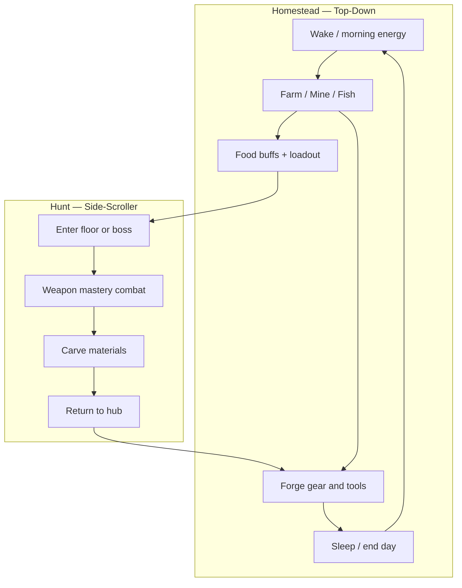

# Destiny Forge — Game Design Document

**Hunt and forge like Monster Hunter. Live and gather like Stardew Valley.**  
Combat is the main challenge; the homestead is the calm half of the day that funds the next hunt.

**Document version:** v1.0 — July 2026

| Version | Date      | Notes                                                                 |
| ------- | --------- | --------------------------------------------------------------------- |
| v0.1    | June 2026 | Initial design from planning session                                  |
| v0.2    | July 2026 | Fresh-start revision: scope, specs, phases                            |
| v1.0    | July 2026 | Rebalanced pillars: combat mastery + MH gear + full Stardew lifestyle |

---

## Table of Contents

1. [Vision & Pillars](#vision--pillars)
2. [Target Player & Tone](#target-player--tone)
3. [Non-Goals](#non-goals)
4. [Core Game Loop](#core-game-loop)
5. [Perspective & World Structure](#perspective--world-structure)
6. [Combat & Hunts](#combat--hunts)
7. [Gear Progression](#gear-progression--monster-hunter-style)
8. [Homestead Systems](#homestead-systems--stardew-style)
9. [Forge & Inventory](#forge--inventory)
10. [Hub & World Layout](#hub--world-layout)
11. [Controls](#controls)
12. [Content Targets](#content-targets)
13. [Phase Plan](#phase-plan)
14. [Art Direction](#art-direction)
15. [Tech Stack & Architecture](#tech-stack--architecture)
16. [Key Decisions](#key-decisions)
17. [Open Questions](#open-questions)
18. [PR Plan](#pr-plan)

---

## Vision & Pillars

**Destiny Forge** is a pixel action-homestead game: you tend a cozy farm above ground, then descend into side-scrolling hunts where weapon mastery and loadout decide whether you carve the parts you need. Better gear and tools make both halves of the day feel more powerful.

| Pillar | Inspiration | Role in Destiny Forge |
| ------ | ----------- | --------------------- |
| **Combat & hunts** | Monster Hunter tempo + deep weapon play | Primary skill ceiling; floors and boss hunts; loadout and timing matter |
| **Gear progression** | Monster Hunter | Weapon trees + multi-piece armor sets with set skills; forge from carves + surface mats |
| **Homestead life** | Stardew Valley | Farming, mining, fishing; day rhythm; food buffs and forge reagents |

### Priority rule

When cozy systems and combat depth fight for scope, **combat depth wins for the next milestone**. Lifestyle systems are designed fully here (not “TBD later”) so they ship as coherent co-pillars immediately after weapon mastery.

### One-sentence pitch

*A Stardew day that ends in a Monster Hunter fight — then you forge tomorrow’s loadout from what you carved.*

---

## Target Player & Tone

**Who:** Players who want short, satisfying hunt-and-craft sessions with real combat skill, plus a cozy homestead to prepare and unwind. Not full MH time sinks; not pure farming sim.

**Tone:** Cozy on the surface, tense underground. Preparation feels calm; hunts feel focused, readable, and skillful.

**Session length (targets):**

| Session | Length | Notes |
| ------- | ------ | ----- |
| Homestead chores | 5–15 min | Farm / mine / fish / forge / eat |
| Floor hunt | 10–20 min | Material farming, trash + elite packs |
| Boss hunt | 10–25 min | Multi-phase set piece |
| Full day loop | 25–45 min | Prep → hunt → carve → forge → sleep |

**Success metrics (near-term):**

- Player completes hunt → carve → craft → re-hunt and feels stronger
- Second boss attempt shows loadout or skill improvement (not just RNG)
- Weapon choice changes *how* you fight, not only DPS numbers
- No crash or soft-lock across 10 consecutive day loops

---

## Non-Goals

- No multiplayer or co-op
- No procedural dungeon generation in early phases (hand-authored floors)
- No mid-dungeon gear swapping
- No shop-bought endgame gear — forging is the path
- No full narrative campaign or quest hub in early phases
- No shared energy bar that drains mid-combo in combat (see [Key Decisions](#key-decisions))
- No open-world MMO scale; one homestead + linked zones is enough

---

## Core Game Loop



**Combat is the climax of the day.** Farming, mining, and fishing are setup and recovery — they fund the forge and food buffs, they are not the whole game.

**Material rule:**

| Source | Supplies |
| ------ | -------- |
| Monster carves | Unique armor sets and weapon branch parts |
| Mining | Base metals / upgrade cores for weapon tiers |
| Farming & fishing | Food buffs + secondary forge reagents |

Hunts remain **mandatory** for set identity. Lifestyle is **not optional filler** — ore and food gate power and comfort — but only carves unlock a monster’s armor set.

---

## Perspective & World Structure

| Zone | Camera | Feel |
| ---- | ------ | ---- |
| Homestead (farm, forge, animals, paths) | **Top-down** | Stardew movement, tools, interactions |
| Mine entrance / mine | **Top-down** | Node mining, depth layers |
| Fishing spots (river / pond) | **Top-down** | Cast minigame overlay |
| Forest (linking zone) | **Top-down** | Travel, light gather, atmosphere |
| Dungeon floors & boss arenas | **Side-scroller** | Platforming + weapon mastery combat |

The perspective shift reinforces the fantasy: calm preparation above, intense hunts below.

---

## Combat & Hunts

Combat is the **skill ceiling** of Destiny Forge — deeper than Stardew by a wide margin; closer to MH Lite / Hollow Knight weapon mastery; still shorter than real Monster Hunter hunts.

### Design goals

1. **Weapon mastery** — each weapon family has its own combos, specials, and timing identity
2. **Readable fights** — telegraphs, clear hitboxes, fair recovery
3. **Loadout identity** — armor set skills and weapon tier change viable approaches
4. **Prep matters** — food buffs and forge upgrades before hard hunts
5. **Carve payoff** — winning yields parts that unlock the next power fantasy

### Fundamentals

| System | Rule |
| ------ | ---- |
| Health | Player and enemies have HP; damage formula `max(1, attack_power - defense)` (tune in playtests) |
| i-frames | Player invulnerability after hit (~0.5–0.65s; match implementation) |
| Knockback | On hit; reduced by armor set skills |
| Block | Hold to reduce/negate frontal damage; commits mobility |
| Parry | Optional mastery window (design target); perfect timing for bonus (deflect, counter frame) |
| Death | Respawn at homestead; **gear and materials kept** |

### Resource model

| Context | Resource |
| ------- | -------- |
| Homestead tools | **Energy** (shared tool pool for farm / mine / fish) |
| Combat basics | No stamina bar |
| Special attacks | **Cooldowns** per special / skill slot |

Specials never drain homestead energy. Homestead energy never gates a basic attack mid-hunt.

### Weapon families (mastery targets)

Each family is a moveset, not a stat stick.

| Family | Identity | Basics | Specials (examples) | Upgrade fantasy |
| ------ | -------- | ------ | ------------------- | --------------- |
| **Sword** | Fast, short, mobile | 2–3 hit combo, quick recovery | Charge dash, spin clear | Faster combo links, air/follow-up options |
| **Spear** | Reach, commit | Poke, multi-hit thrust | Long lunge, sweep | Longer hit windows, wall-pin feel |
| **Hammer** *(later)* | Stun / stagger | Slow heavy swings | Ground pound, armor break | Boss stagger loops |

**Current implementation baseline:** Rusty/Iron/Slime sword line, Rusty Spear, shared Charge + Spin specials, block, skill bar. Target design **diverges** toward per-weapon combos and unique specials rather than shared generic swings with different numbers.

### Hunt structure

| Hunt type | Length | Purpose |
| --------- | ------ | ------- |
| **Floor hunt** | 10–20 min | Packs + elites; carve common/uncommon parts; learn patterns |
| **Boss hunt** | 10–25 min | Multi-phase set piece; rare parts; set unlocks |

**Boss design rules:**

- Clear phase transitions (HP thresholds or scripted beats)
- 2–4 major attack patterns per phase; readable wind-ups
- Armor set or weapon branch should open a *new* answer (not mandatory cheese)
- King Slime is the template boss for Floor 1

### Carve

- Approach corpse, hold interact (~2s base)
- Interruptible on damage
- One carve per corpse; yields loot table for that species
- Set skills can reduce carve time

### What already exists (code)

- Melee attack hitboxes, knockback, hit flash
- Block, Charge, Spin specials, skill bar bindings
- Enemy projectiles, contact damage
- Enemy corpses + carve flow
- Floor 1 content + King Slime boss
- Player death → hub respawn path

---

## Gear Progression — Monster Hunter Style

### Weapons

- Crafted and upgraded at the **forge** (never shop endgame)
- Upgrade trees change **feel** (combo, special, reach) as well as power
- Some tiers **consume the previous weapon** (e.g. Slime Blade requires Iron Sword)
- Weapons are brought into hunts; death does not destroy gear

```text
Rusty Sword → Iron Sword → (monster branch, e.g. Slime Blade)
Rusty Spear → Iron Spear → (monster branch)
                 ↘ future hammer line …
```

Metal tiers (Rusty → Iron → …) lean on **mined ore**. Monster branches lean on **carves**.

### Armor sets

| Slot | Piece |
| ---- | ----- |
| Head | Helm |
| Chest | Mail |
| Arms | Gauntlets |
| Legs | Greaves |

**Set bonuses stack by tier:** 4-piece includes 2-piece effects.

| Example | 2-piece | 4-piece |
| ------- | ------- | ------- |
| Slime Set | +10% carve speed | +35% knockback resist (keeps 2pc) |

**Set skills should bridge pillars** over time:

| Domain | Example skills |
| ------ | -------------- |
| Combat | Knockback resist, attack up, guard boost, special CD reduction |
| Hunt QoL | Carve speed, rare part chance |
| Homestead | Mining yield, farming growth tick, fishing bite rate |

Mix-and-match is allowed; full sets remain the power fantasy.

### Materials triad

| Source | MVP / now | Target |
| ------ | --------- | ------ |
| Monster carve | Primary unique parts | Expanded tables per species / break parts later |
| Ore | Placeholder drops (`IronScrap`) | Surface mining + pickaxe tiers |
| Crops / fish | — | Food buffs + secondary reagents |

---

## Homestead Systems — Stardew Style

These systems carry the **cozy feel** and feed progression. They are designed here for full implementation; code today has layout zones and decorative animals only.

### Day cycle & energy

| Rule | Detail |
| ---- | ------ |
| Soft day | Morning → afternoon → evening → sleep |
| Hunt cost | Entering a dungeon hunt consumes a **large portion** of the day (choose prep-heavy vs hunt-heavy days) |
| Energy | Shared pool for **tools only** (hoe, watering can, pickaxe, fishing rod) |
| Sleep | Restores energy; advances day; optional crop growth tick |
| Combat | Unaffected by energy; specials on cooldown |

**Sweet spot:** one solid hunt + a block of homestead chores per day.

### Farming

**Stardew borrow:** till → plant → water → grow → harvest.

| Element | Design |
| ------- | ------ |
| Plots | Homestead crop zone (layout exists as `HomesteadZone::Crops`) |
| Tools | Hoe, watering can; upgrade tiers reduce energy cost / increase area |
| Crops | Starter set (e.g. 4–6 crops); simplified seasons OK for v1 |
| Outputs | **Food buffs** (attack, defense, carve speed, energy restore) + some forge reagents |
| Armor hooks | Set skills can boost yield or reduce water needs |

### Mining

**Stardew borrow:** nodes, depth, pickaxe tiers, tool energy.

| Element | Design |
| ------- | ------ |
| Access | Mine entrance from homestead / forest |
| Loop | Break nodes → ore + stones; deeper layers unlock higher metals |
| Tools | Pickaxe tiers gate hardness |
| Outputs | **Ore for weapon metal spine** (replaces placeholder dungeon iron) |
| Risk | Optional light hazards later; combat focus stays in dungeons |

**Done when:** forge metal tiers primarily require mined ore, not dungeon scrap.

### Fishing

**Stardew borrow:** cast + timing minigame, rod tiers, location/time variety.

| Element | Design |
| ------- | ------ |
| Spots | River / pond on or near homestead |
| Loop | Cast → bite → timing bar → catch |
| Tools | Rod tiers improve bar size / rare chance |
| Outputs | **Food** + secondary craft inputs; **not** unique set-defining carves |
| Armor hooks | Bite rate / quality skills |

### Homestead feel checklist

- Readable cozy art; animals and crop tiles sell the fantasy even before full systems
- Inventory satisfaction (stacking, sorting later)
- Short feedback loops (water today, harvest in N days — keep N small for early game)
- Never force pure chore days forever; hunts always available if energy/time allows

---

## Forge & Inventory

### Forge

- Station on homestead (`HomesteadZone::Forge`)
- Recipes: materials (+ optional prior weapon) → gear or tool
- Validate inventory before craft; consume on success
- Show set-bonus preview when crafting armor
- Upgrade tools (pickaxe, rod, hoe) as well as weapons/armor over time

### Inventory & loadout

| Slot type | Capacity / rule |
| --------- | --------------- |
| Materials | 24 stack slots (MVP; expand if lifestyle floods inventory) |
| Weapon | 1 equipped |
| Armor | 4 slots (head, chest, arms, legs) |
| Tools | Equipped tool for homestead interactions (design target) |
| Food | Consumable buffs before hunts (design target) |

- Gear is equipped or forged; no mid-dungeon swap
- Quick swap / forge UI only at hub

### Food buffs (design target)

| Example | Effect | Duration |
| ------- | ------ | -------- |
| Hearty stew | +defense | One hunt or until sleep |
| Spicy sashimi | +attack | One hunt |
| Focus tea | Slight special CD reduction | One hunt |

Buffs are **prep**, not a replacement for skill.

---

## Hub & World Layout

### Current homestead zones (implemented layout)

```text
[House]     [Forest trail ↑]
[Crops]     [Animals]
            [Forge]
        [Dungeon gate ↓]
```

| Zone | Status |
| ---- | ------ |
| House / spawn | Present |
| Forge | Interactive craft |
| Crops | Farming simulated: till / plant / water / harvest + persist |
| Animals | Decorative wanderers |
| Forest trail | Transition to forest zone |
| Dungeon gate | Transition to Floor 1 |

### Target long-term surface

- Functional farm plots + chest storage
- Mine entrance
- Fishing dock / river
- Forge as permanent progression hub
- Clear path to dungeon / forest

---

## Controls

### Homestead (top-down)

| Input | Action |
| ----- | ------ |
| WASD | Move |
| E | Interact (forge, doors, NPCs, beds) |
| LMB / tool key | Use equipped tool (hoe, water, mine, cast) |
| 1–9 / skill bar | Hotbar items/tools (as systems land) |
| Inventory key | Open bags |

### Hunt (side-scroller)

| Input | Action |
| ----- | ------ |
| WASD | Move |
| Space | Jump |
| Attack skill | Weapon combo / basic attack |
| Block skill | Guard |
| Special skills | Cooldown specials (charge, spin, weapon uniques) |
| E (hold) | Carve corpse |
| E | Exit ladder when near |

Exact keybinds follow the skill-bar system already in code; rebind support is a polish goal.

---

## Content Targets

### Monsters (near-term)

| Monster | Role | Notes | Carve focus |
| ------- | ---- | ----- | ----------- |
| Slime | Starter | Patrol / chase | Gel, Core |
| Bat | Flyer / pressure | Swoop / projectile | Wing, Fang |
| King Slime | Floor 1 boss | Multi-phase template | Rare cores / set unlocks |
| *Next set monster* | Phase content | New armor set | Branch weapon mats |

Tuning numbers live in code and playtests; GDD does not freeze HP forever.

### Weapons (near-term tree)

| Item | Tier | Role |
| ---- | ---- | ---- |
| Rusty Sword | 0 | Default; learn combo |
| Iron Sword | 1 | Metal tier; ore-gated |
| Slime Blade | 2 | Monster branch; carve-gated |
| Rusty Spear | 1 | Reach family entry |
| Iron Spear | 2 | Metal spear (content target) |
| *Monster spear branch* | 3 | Moveset + carve identity |

### Armor — Slime Set (shipping baseline)

| Piece | Role |
| ----- | ---- |
| Slime Helm / Mail / Gauntlets / Greaves | Starter full set |

**Bonuses:** 2pc carve speed; 4pc knockback resist (includes 2pc).

### Homestead content (first shippable slice)

| System | First slice |
| ------ | ----------- |
| Farming | Till/water/harvest 2–3 crops; 1–2 food recipes |
| Mining | One mine layer; copper/iron-equivalent; pickaxe tier 1–2 |
| Fishing | One spot; basic minigame; 3–5 fish; 1 food recipe |

---

## Phase Plan

Status reflects the repo at v1.0 doc time. Combat priority overrides lifestyle when scheduling.

### Phase 0 — Foundation *(largely done)*

- [x] Bevy project structure, plugins by domain
- [x] App states: Title, Overworld, Forest, Dungeon
- [x] Side-scroller dungeon Floor 1, platforms, player controller
- [x] Combat baseline: attack, block, charge, spin, projectiles, hurt/death
- [x] Monsters + carve + material inventory
- [x] Forge recipes: sword line, rusty spear, slime set
- [x] Homestead layout zones + forest link
- [x] Save / profiles / settings (`src/core/memory/`)

**Done when:** hunt → carve → craft → re-hunt works end-to-end (already true).

### Phase 1 — Weapon mastery *(current design priority)*

- [ ] Per-weapon combo strings (sword vs spear feel distinct beyond stats)
- [ ] Specials become weapon-owned where appropriate; **cooldown UI** and tuning
- [ ] Block mastery / parry window prototype
- [ ] Boss multi-phase clarity (King Slime as reference hunt)
- [ ] Armor set skills that change combat choices (not only carve QoL)
- [ ] Juice: hit stop, clearer telegraphs, audio feedback pass

**Done when:** choosing sword vs spear is a playstyle decision; a skilled run of the boss feels earned.

### Phase 2 — Homestead spine

- [ ] Soft day cycle + sleep
- [ ] Tool energy pool for homestead tools
- [ ] Functional crop plots (plant/water/grow/harvest)
- [ ] Food cooking + pre-hunt buffs
- [ ] Inventory UX for crops/fish/ore stacks

**Done when:** a full day can be chores → food → hunt → forge → sleep without debug cheats.

### Phase 3 — Mining

- [ ] Mine zone + ore nodes + depth/hardness
- [ ] Pickaxe tiers
- [ ] Forge recipes require mined ore for metal tiers
- [ ] Remove or heavily reduce placeholder dungeon iron dependence

**Done when:** weapon metal spine is mine-driven.

### Phase 4 — Fishing

- [ ] Fishing spots + cast minigame
- [ ] Rod tiers
- [ ] Fish food recipes + secondary reagents
- [ ] At least one forge recipe optionally improved by fish reagents

**Done when:** fishing is a reliable prep path, not a dead zone.

### Phase 5 — Content & balance

- [ ] Second armor set + second boss hunt
- [ ] Additional weapon branches / hammer family prototype
- [ ] Second dungeon floor
- [ ] Audio, UI polish, set-bonus readability
- [ ] Balance pass for day length, energy, and hunt difficulty

**Done when:** 2+ hours of progression without pure repetition fatigue.

---

## Art Direction

The GDD cozy Stardew / warm-earthy-green look is **superseded**. User reference is the north star. Taste signed the hunter attack pair 2026-08-28; do not reopen that strip.

| Spec | Value |
| ---- | ----- |
| Tile size | 16×16 (homestead / dungeon environment) |
| Hunter cell | ~160px tall, 1× nearest-neighbor. Idle ~163×160. Do **not** crush to 16×28. |
| Attack strip | Windup chamber 139px (blade over the shoulder); hit 343px (reach is the blade). Uniform loader cell 343×160. |
| Render | 1× nearest-neighbor, no smoothing, no linear filter |
| Look | Gritty forge-meets-neon |
| Palette | Weathered browns, dark grays, neon purple piping, electric-blue circuitry, brass |
| Player | Distressed leather duster, brass mechanical gauntlet (LEFT, purple cable), techno-energy sword in the glove (RIGHT), Rust-language **R** on the chest |
| Homestead forge | Top-down pad-view landmark. Dual perspective stays. Not a side-view sheet. |
| UI | Dark chrome with purple/cyan highlights |
| Combat VFX | Readable silhouettes; wind-ups readable at a glance. Hurtbox is the body; reach is the blade. |

Do **not** ship 64×64 tiles, 64×112 characters, or linear/anime filtering. That pipeline is a reject (PR #70).

**Pipeline:** source art under `assets/source/` → processed gameplay sprites under `assets/`. Attribution in `assets/ATTRIBUTION.txt`. Keep gameplay filenames stable for loaders (`knight_*`, `dwarf_m_*`, `forge_furnace.png`) even when the pixels are the hunter / grit-neon forge.

---

## Tech Stack & Architecture

| Layer | Choice | Rationale |
| ----- | ------ | --------- |
| Language | Rust | Safety + performance for sim + combat |
| Engine | Bevy 0.15 | ECS scales across homestead + hunts |
| Data | Rust constants → RON | Fast iteration now; data files as content grows |
| Saves | serde + profiles | Multi-slot progress |

### Code map (current)

```text
src/
├── core/        # States, save/load, teardown
├── graphics/    # Camera, world units, pixel scale
├── dungeon/     # Floors, enemies, boss, carve hooks
├── combat/      # Attack, block, specials, health, skills
├── forging/     # Recipes, craft validation
├── items/       # Materials, inventory
├── player/      # Loadout, world progress
├── ui/          # Forge, inventory, skill bar, menus
├── overworld/   # Homestead top-down
├── forest/      # Linking zone
├── exploration/ # Shared layout helpers
├── audio/       # Music, SFX
└── main.rs      # Plugin registration only
```

Engineering conventions: [`CODING_STANDARDS.md`](CODING_STANDARDS.md).

---

## Key Decisions

| Date | Decision | Rationale |
| ---- | -------- | --------- |
| 2026-07 | Combat is the skill ceiling; homestead is prep/recovery | Differentiates from pure Stardew; keeps MH fantasy |
| 2026-07 | Tool **energy** only; combat specials use **cooldowns** | Stardew chores without stamina-cancelling combos |
| 2026-07 | Weapon **mastery** (combos, per-weapon movesets, multi-phase bosses) | Deeper than Stardew; shorter than real MH |
| 2026-07 | Soft day cycle; hunts cost a large share of the day | Meaningful prep vs hunt choices |
| 2026-07 | Dual perspective (top-down surface / side-scroll hunts) | Reinforces dual fantasy; already implemented |
| 2026-07 | Lifestyle feeds forge + food buffs; unique sets from carves | Hunts stay mandatory; chores stay valuable |
| 2026-07 | Death: hub respawn; keep gear and materials | Cozy failure; preserves craft momentum |
| 2026-07 | No shop endgame gear | Forge-centric MH loop |
| 2026-07 | Phase priority: mastery → homestead → mine → fish → content | Combat-first scheduling with full lifestyle design |
| 2026-07 | 4-slot sets; 4pc includes 2pc | Clear MH-style set goals |
| 2026-07 | Carve: hold interact ~2s, interruptible | Readable, skill-adjacent risk |
| 2026-08 | Art north star is grit-neon, not cozy Stardew | User reference supersedes GDD palette |
| 2026-08 | Hunter ~160px 1× NN; tiles stay 16×16 | Crushing idle to 16×28 killed the look |
| 2026-08 | Dual perspective: hunter side-view, homestead forge top-down pad | Foreman lock; forge is not a side sheet |
| 2026-08 | Attack strip Taste-signed: chamber 139 + hit 343 | Do not reopen; laterality brass+purple LEFT, sword RIGHT |

---

## Open Questions

- Exact day length in minutes and how much “day” a boss hunt consumes
- Parry: ship in Phase 1 or defer to Phase 5 polish
- Seasons: full four-season crops vs simplified growth timers only
- Mine: single branching cave vs Stardew-like descending floors
- Whether spear/sword should share any specials after mastery split
- Inventory size after lifestyle systems come online (24 may be tight)
- Difficulty: static enemy stats vs light scaling on repeat clears

---

## PR Plan

Implementation order after this design is accepted. Each PR should be independently playable/reviewable.

| PR | Title | Scope | Depends on |
| -- | ----- | ----- | ---------- |
| PR1 | Weapon combo foundation | Combo state machine; sword 2–3 hit string; hitbox windows per step | — |
| PR2 | Spear moveset split | Distinct spear poke/lunge; remove spear “sword swing” feel | PR1 |
| PR3 | Special cooldowns + UI | CD resource per special; skill bar feedback; tune Charge/Spin | — |
| PR4 | Weapon-owned specials | Map specials to families; data-driven special defs | PR2, PR3 |
| PR5 | Boss phase clarity | King Slime telegraph/phase polish; hunt-length pass | — |
| PR6 | Combat set skills v1 | Wire 2pc/4pc into combat modifiers beyond carve/KB | — |
| PR7 | Day cycle + sleep | Soft day resource; sleep restores; hunt day-cost hook | — |
| PR8 | Tool energy | Energy pool; drain on tool use; UI meter | PR7 |
| PR9 | Farming v1 | Till/plant/water/harvest on crop zone; 2–3 crops | PR8 |
| PR10 | Food buffs | Cook/eat; timed buffs into dungeon | PR9 |
| PR11 | Mining v1 | Mine zone, nodes, pickaxe tiers, ore → recipes | PR8 |
| PR12 | Fishing v1 | Spot, minigame, rod, fish items, one food recipe | PR8 |
| PR13 | Content set 2 | New monster/set/boss floor slice | PR4–PR6 |
| PR14 | Polish pass | Audio, juice, inventory sorting, set preview UX | Content PRs |

**Parallelism notes:** PR3 and PR5 can run beside PR1. Homestead PRs (7–12) start after Phase 1 combat PRs land enough mastery to protect the combat-first priority rule.

---

## Vertical Slice (updated)

The fantasy is proven when a player can:

1. Wake on the homestead with energy for tools  
2. Do a short chore block (or skip if systems not yet shipped)  
3. Eat a food buff and set loadout at the forge  
4. Enter a hunt and win with **weapon-appropriate** play  
5. Carve parts, return, craft the next armor piece or weapon tier  
6. Sleep, and feel the next day open new options  

Until homestead systems ship, steps 1–2–6 may be partial; steps 3–5 already approximate today’s loop and remain the non-negotiable core.

---

*End of GDD v1.0*
