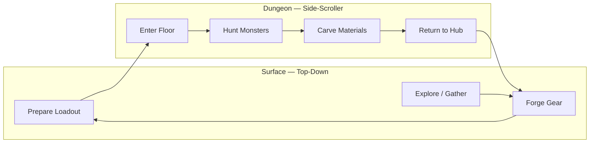

# Destiny Forge — Game Design Document

A pixelated Rust game that blends **Stardew Valley**-style farming and mining with **Monster Hunter**-style weapon and armor progression.

**Document version:** v0.2 — July 2026

| Version | Date       | Notes                                      |
| ------- | ---------- | ------------------------------------------ |
| v0.1    | June 2026  | Initial design from planning session       |
| v0.2    | July 2026  | Fresh-start revision: scope, specs, phases |

---

## Table of Contents

1. [Vision](#vision)
2. [Target Player & Tone](#target-player--tone)
3. [Non-Goals](#non-goals)
4. [Vertical Slice](#vertical-slice)
5. [Perspective & World Structure](#perspective--world-structure)
6. [Core Game Loop](#core-game-loop)
7. [Controls](#controls)
8. [Hub Layout](#hub-layout)
9. [Tech Stack](#tech-stack)
10. [Architecture](#architecture)
11. [Coding Standards](#coding-standards)
12. [Progression](#progression--monster-hunter-style)
13. [Systems Detail](#systems-detail)
14. [Phase Plan](#phase-plan)
15. [MVP Content Targets](#mvp-content-targets)
16. [Art Direction](#art-direction)
17. [Decisions](#decisions)
18. [Open Questions](#open-questions)

---

## Vision

**Destiny Forge** is a cozy-yet-challenging loop: tend your homestead above ground, then descend into dungeons to hunt monsters, carve materials, and forge gear that changes how you fight and farm.

| Inspiration    | What we borrow                                                                           |
| -------------- | ---------------------------------------------------------------------------------------- |
| Stardew Valley | Day cycles, tile-based farming, mining, inventory, satisfying resource loops             |
| Monster Hunter | Craft gear from monster parts, weapon upgrade trees, armor set bonuses, prep-before-hunt |

### Long-term pillars (post-MVP)

- **Fish farming** — ponds, species, feed, harvest yields → forge inputs and food
- **Surface mining** — ore nodes, pickaxe tiers, stamina → base metals for weapons
- **Homestead** — top-down farm, mine entrance, forge, town
- **Dungeons** — side-scrolling floors, monsters, loot
- **Forging** — weapons and armor crafted from carved materials

---

## Target Player & Tone

**Who:** Players who enjoy short, satisfying hunt-and-craft sessions without Monster Hunter's hour-long fights or steep onboarding.

**Tone:** Cozy on the surface, tense underground. Preparation feels calm; dungeons feel focused and punchy.

**Session length:**

- **Dungeon run:** 15–30 minutes per floor
- **Forge visit:** ~5 minutes between runs
- **Full loop (MVP):** under 30 minutes from hub exit to first meaningful craft

**MVP success metrics:**

- Player completes one full hunt → carve → craft → re-hunt cycle
- Second run feels meaningfully easier with new gear (faster kills or faster carving)
- No crash or soft-lock across 10 consecutive loops

---

## Non-Goals

Explicit scope boundaries for the MVP and early phases:

- No multiplayer or co-op
- No procedural dungeon generation (hand-authored floors)
- No mid-dungeon gear changes
- No farming, fishing, or surface mining until post–Phase 1
- No shop or currency economy — all gear is forged from materials
- No narrative campaign or quest system in MVP

---

## Vertical Slice

The smallest shippable proof that the core fantasy works. Every Phase 1 milestone serves this session:

1. Spawn at hub with Rusty Sword equipped
2. Walk to dungeon entrance, enter Floor 1
3. Defeat 2 Slimes and 1 Bat using melee combat
4. Carve all three corpses
5. Return to hub via ladder exit
6. Craft Iron Sword at the forge
7. Re-enter the dungeon and notice faster kills or easier carving with Slime armor (if crafted)

**Phase 1 done when:** this session is playable start-to-finish without crashes.

---

## Perspective & World Structure

| Zone                         | Camera            | Notes                                                                      |
| ---------------------------- | ----------------- | -------------------------------------------------------------------------- |
| Overworld (farm, mine, town) | **Top-down**      | Tilemap-based, Stardew-like movement and interaction                       |
| Dungeons                     | **Side-scroller** | Platformer combat, room/floor transitions, distinct feel from surface life |

The shift in perspective reinforces the fantasy: calm preparation above, intense hunts below.

---

## Core Game Loop



**MVP loop (Phase 1):** enter dungeon → fight monsters → carve parts → return to hub → craft weapons and armor at the forge → re-enter with better gear.

Farming, surface mining, and fish farming plug into this loop later as additional material sources feeding the forge.

---

## Controls

### Hub (top-down)

| Input        | Action                          |
| ------------ | ------------------------------- |
| WASD         | Move                            |
| E            | Interact (dungeon door, forge)  |
| Up / Down    | Cycle forge recipes             |
| F            | Craft selected recipe           |

### Dungeon (side-scroller)

| Input        | Action                          |
| ------------ | ------------------------------- |
| WASD         | Move                            |
| Space        | Jump                            |
| J            | Attack (weapon-dependent)       |
| E (hold)     | Carve corpse (2s, interruptible)|
| E            | Exit via ladder (when near)     |

---

## Hub Layout

Minimal MVP hub — three interactable zones on a single screen:

```text
[Spawn] ——————— [Forge] ——————— [Dungeon Entrance]
```

- **Spawn:** player start position after loading or respawning
- **Forge:** recipe selection and crafting
- **Dungeon Entrance:** transitions to Floor 1

Full farm, mine, and town zones are deferred to Phase 2+.

---

## Tech Stack

| Layer               | Choice                         | Rationale                                                    |
| ------------------- | ------------------------------ | ------------------------------------------------------------ |
| Language            | **Rust**                       | Performance, safety, good fit for game logic                 |
| Engine              | **Bevy**                       | ECS architecture scales for farming sim + combat + inventory |
| Overworld rendering | **bevy_ecs_tilemap**           | Pixel tilemaps, 16×16 tiles                                  |
| Dungeon rendering   | **Bevy 2D** (sprites, cameras) | Side-scroller layers, parallax optional later                |
| Game data           | **RON / TOML**                 | Fish species, ores, weapons, armor, recipes as data files    |
| Saves               | **serde + bincode** (or RON)   | World state, inventory, gear, dungeon progress               |

**Data migration note:** MVP recipes and loot tables may start as Rust constants for speed. Migrate to `assets/data/*.ron` before Phase 2 content expansion.

---

## Architecture

Greenfield Bevy project. Organize by **game mode** and **domain**, not by a single giant update loop.

```
src/
├── core/           # App states, time, save/load, scene transitions
├── graphics/       # Sprites, tilemaps, camera, animation, pixel scale
├── dungeon/        # Side-scroller: floors, rooms, platforming, spawns
├── combat/         # Hitboxes, damage, weapons, armor skills
├── forging/        # Recipes, forge UI, craft validation
├── items/          # Materials, weapons, armor, stacks
├── progression/    # Weapon trees, armor sets, unlock rules
├── player/         # Movement (mode-specific), stats, loadout
├── ui/             # Inventory, forge, HUD, menus
├── overworld/      # Top-down zones (stub until post-MVP)
└── main.rs         # Plugin registration only
```

**Asset pipeline:** AI-generated source art in `assets/source/` → processed by `tools/generate_sprites.py` and related scripts → gameplay sprites in `assets/sprites/`. Art specs (tile size, frame layout) live in [Art Direction](#art-direction).

---

## Coding Standards

Engineering conventions (Clean Code, SOLID, testing, error handling): see [`CODING_STANDARDS.md`](CODING_STANDARDS.md).

---

## Progression — Monster Hunter Style

### Weapons (MVP: basic line)

Start with a small weapon roster, each with a short upgrade tree:

| Weapon | Role                              | Attack feel                          |
| ------ | --------------------------------- | ------------------------------------ |
| Sword  | Balanced melee                    | Fast swings, short range             |
| Spear  | Reach, slower                     | Longer hitbox, slower wind-up        |

*(Optional later: Rod, Hammer, etc.)*

Each tier requires specific **monster materials + base ore** (ore as placeholder dungeon drops until surface mining exists).

```text
Rusty Sword → Iron Sword → Slime Blade
                ↓
            Rusty Spear → (future) Slime Core Pike
```

**Design rules:**

- Upgrades are crafted at the forge, not bought
- Weapon upgrades that replace a tier consume the previous weapon (e.g. Slime Blade requires Iron Sword)
- Higher tiers unlock new attack properties (range, combo, special) — not just +damage
- Weapons are brought into dungeons; death does not destroy gear

### Armor sets (MVP focus)

Armor is organized in **sets** with **slot pieces** and **set bonuses**:

| Slot  | Example piece |
| ----- | ------------- |
| Head  | Helm          |
| Chest | Mail          |
| Arms  | Gauntlets     |
| Legs  | Greaves       |

**Example starter set — Slime Set** (from early dungeon monster):

| Pieces equipped | Set bonus                     | Stacks with lower tiers? |
| --------------- | ----------------------------- | ------------------------ |
| 2               | +10% carve speed              | —                        |
| 4               | 35% knockback resist          | Yes — includes 2pc bonus |

**Design rules:**

- Each piece requires carved parts from specific monsters
- Mix-and-match allowed; set bonuses encourage full sets
- Armor skills affect dungeon combat first; later extend to fishing/mining (e.g. Aquaculture +20%)

### Materials

| Source        | MVP                       | Later                            |
| ------------- | ------------------------- | -------------------------------- |
| Monster carve | Primary for forge         | Expanded part tables per species |
| Ore           | Placeholder dungeon drops | Surface mining                   |
| Fish          | —                         | Fish farming                     |

---

## Systems Detail

### Dungeons (side-scroller) — **Phase 1 priority**

- **One hand-authored floor** for MVP (second floor in Phase 2)
- Platform collision, ledges, room transitions
- Monster spawns with simple AI (patrol, chase, attack)
- **Carve** interaction on defeated monsters (see [Combat & Carve](#combat--carve))
- Ladder exit to hub (forge hub stub is fine for MVP)
- Drop tables: parts mapped to armor set and weapon upgrades

### Forging — **Phase 1 priority**

- Forge station in hub
- Recipe definitions: inputs → output gear (Rust constants MVP; RON later)
- Validate inventory materials before craft
- Consume materials on success; equip weapon / armor slots
- Show set bonus preview when crafting armor

### Combat & Carve

**Combat:**

- Melee hitboxes tied to equipped weapon (sword: short/fast, spear: long/slow)
- Player and enemy health
- Damage formula: `max(1, attack_power - defense)` (tune in playtesting)
- i-frames on player hit: **0.5s** (tune later)
- Knockback on hit; reduced by armor set bonuses
- Basic attack per weapon; one weapon-specific behavior per tier if time allows

**Death:**

- Player respawns at hub spawn point
- Gear and materials are kept (see [Decisions](#decisions))

**Carve (MVP):**

- Approach defeated monster corpse, hold **E** for **2 seconds**
- Carving is interruptible if the player takes damage
- One carve per corpse; yields all parts from that monster's loot table
- Set bonuses (e.g. +10% carve speed) reduce hold duration

### Inventory & loadout

- **24 material stack slots** (carved parts, placeholder ore)
- Equipped: 1 weapon + 4 armor slots (head, chest, arms, legs)
- Gear is not stored in inventory — only equipped or uncrafted
- Quick swap at forge only (no mid-dungeon gear change in MVP)

### Overworld (top-down) — **stub for MVP**

- Minimal hub: spawn point, forge building, dungeon entrance (see [Hub Layout](#hub-layout))
- Top-down movement so transition surface ↔ dungeon is real
- Full farm/mine/fish systems deferred

---

## Phase Plan

### Phase 1 — Dungeons & Forging *(current focus)*

Build in dependency order:

1. [ ] Greenfield Bevy project structure (see [Architecture](#architecture))
2. [ ] App states: Hub ↔ Dungeon transitions
3. [ ] Side-scroller dungeon: one floor, platforms, player controller
4. [ ] Basic combat: attack, damage, death, respawn at hub
5. [ ] 1–2 monster types with carve loot tables
6. [ ] Carve interaction + material inventory
7. [ ] Hub stub: spawn, forge, dungeon entrance
8. [ ] Forge: craft Sword line (Rusty → Iron → Slime Blade)
9. [ ] Forge: craft Spear line (Rusty Spear) + Slime Set (4 pieces, set bonuses)

**Done when:** [Vertical Slice](#vertical-slice) is playable end-to-end.

### Phase 2 — Overworld & loop polish

1. [ ] Save / load (inventory, loadout, dungeon progress)
2. [ ] Top-down hub zone (tilemap)
3. [ ] Day/night or run-based pacing
4. [ ] Second dungeon floor + second armor set

**Done when:** progress persists across sessions; two floors offer distinct gear goals.

### Phase 3 — Surface mining

- [ ] Mine zone (top-down)
- [ ] Ore nodes, pickaxe tiers
- [ ] Ore feeds forge recipes (replaces placeholder dungeon ore drops)

**Done when:** ore comes primarily from mining, not dungeon drops.

### Phase 4 — Fish farming

- [ ] Ponds, species, growth timers
- [ ] Fish as food or crafting inputs

**Done when:** at least one forge recipe requires fish materials.

### Phase 5 — Content & balance

- [ ] More monsters, armor sets, weapon branches
- [ ] Audio: hit, carve, craft success, ambient hub/dungeon
- [ ] Juice: screen shake, hit flash, carve particles
- [ ] UI polish: forge recipe preview, set bonus display, inventory sorting

**Done when:** content roster supports 2+ hours of progression without repetition fatigue.

---

## MVP Content Targets

### Monsters (dungeon)

| Monster | Role                 | HP  | Damage | Behavior              | Carve parts           | Carve time |
| ------- | -------------------- | --- | ------ | --------------------- | --------------------- | ---------- |
| Slime   | Starter enemy        | 30  | 8      | Slow patrol, chase    | Slime Gel, Slime Core | 2.0s       |
| Bat     | Light ranged / flyer | 20  | 6      | Hover, swoop attack   | Leather Wing, Fang    | 2.0s       |

*HP, damage, and carve time are initial tuning targets.*

### Weapons

| Item        | Tier | Attack power | Reach | Key materials                       |
| ----------- | ---- | ------------ | ----- | ----------------------------------- |
| Rusty Sword | 0    | 10           | Short | Default loadout                     |
| Iron Sword  | 1    | 14           | Short | Slime Gel ×5, Iron Scrap ×3         |
| Slime Blade | 2    | 18           | Short | Slime Core ×2, Iron Sword (upgrade) |
| Rusty Spear | 1    | 12           | Long  | Slime Gel ×3, Fang ×2               |

### Armor — Slime Set

| Piece           | Defense | Materials                   |
| --------------- | ------- | --------------------------- |
| Slime Helm      | 2       | Slime Gel ×4                |
| Slime Mail      | 4       | Slime Gel ×6, Slime Core ×1 |
| Slime Gauntlets | 1       | Slime Gel ×3                |
| Slime Greaves   | 2       | Slime Gel ×3                |

**Set bonuses:** 2pc +10% carve speed; 4pc 35% knockback resist (4pc includes 2pc bonus). Values subject to playtesting.

---

## Art Direction

| Spec              | Value                                      |
| ----------------- | ------------------------------------------ |
| Tile size         | 16×16 pixels                               |
| Character frames  | 16×32 pixels (Stardew-style proportions)   |
| Render scale      | 3× (pixel art upscaled without smoothing)  |
| Palette           | Warm, Stardew-inspired — earthy greens, wood tones, soft highlights |
| Shading           | Multi-tone per sprite (2–3 shades per color) |
| Buildings         | Cozy, readable silhouettes; forge and mine entrance distinct at a glance |

**Pipeline:** generate source art → process via `tools/generate_sprites.py` → output to `assets/sprites/`. Rebuild command documented in `assets/source/ATTRIBUTION.txt`.

---

## Decisions

Resolved design questions. Update this table when choices change.

| Date       | Decision                        | Rationale                                           |
| ---------- | ------------------------------- | --------------------------------------------------- |
| 2026-07    | Death respawns at hub           | Cozy tone; avoids punishing new players             |
| 2026-07    | Gear and materials kept on death| Preserves craft-loop momentum                       |
| 2026-07    | Unlimited movement (no stamina)| Reduces MVP tuning surface; revisit in Phase 3 mining |
| 2026-07    | 24 material inventory slots     | Enough for one floor's drops without constant trips |
| 2026-07    | One floor for MVP               | Vertical slice focus; second floor in Phase 2       |
| 2026-07    | Carve: hold E for 2s             | Simple input, readable feedback, interruptible      |
| 2026-07    | Set bonuses stack by tier       | 4pc includes 2pc bonus                              |
| 2026-07    | Recipes in Rust for MVP         | Faster iteration; migrate to RON before Phase 2     |

---

## Open Questions

- Iron Spear tier-2 upgrade timing — Phase 2 or Phase 5?
- Day/night cycle vs. run-based pacing for Phase 2?
- Should Bat corpses fall to the ground or hang in place for carving?
- Difficulty knob: enemy HP scaling on repeat visits, or static tuning?